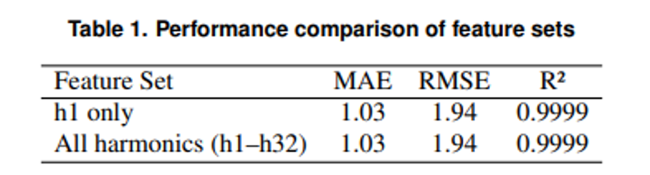
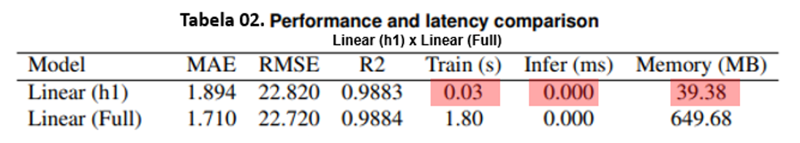

# Harmonic Analysis for Edge-Based Smart Grids
## Feature Engineering and Network-Efficient Power Estimation

> **Authors:** Silva et al. (2026)  
> **Institution:** University of Brasília (UnB), Brazil  
> **Repository:** [Harmonic-Analysis-for-Edge-Based-Smart-Grids](https://github.com/leonardolsms/Harmonic-Analysis-for-Edge-Based-Smart-Grids.git)

---

### ⚡ CONTEXT / PROBLEM
High-frequency electrical measurements enable detailed harmonic analysis for advanced applications like **Non-Intrusive Load Monitoring (NILM)**. However, current research trends favor increasingly complex deep learning models. These models impose:
*   **High Computational Cost:** Limiting deployment on low-power hardware.
*   **Network Overhead:** Requiring massive data transmission to the cloud.
*   **Latency Issues:** Hindering real-time response in smart grid environments.

### 🎯 OBJECTIVE
This research investigates the role of **feature engineering** in harmonic-based power estimation. The goal is to shift from *model-centric complexity* to *feature-centric design*, enabling lightweight, network-efficient, and edge-ready intelligence.

### 🛠️ METHODOLOGY
*   **Data Acquisition:** High-frequency NILM dataset (8 kHz sampling) using the ATM90E36A energy metering IC.
*   **Feature Space:** Extraction of current harmonics from the 1st to the 32nd order (h1–h32).
*   **Experimental Protocol:** Leakage-aware design with session-based train/test splits to prevent data contamination.
*   **Benchmarking:** Comparative analysis between lightweight linear models and sophisticated deep learning architectures (e.g., Seq2Point).

### 📈 KEY FINDINGS
> **The Dominance of the Fundamental Harmonic (h1)**
> 
>
> 
> **Result:** h1 alone explains nearly all variance in active power (**R² ≈ 0.9999**).


The study reveals that adding higher-order harmonics (h2–h32) does not significantly improve predictive performance. The underlying mapping is inherently low-complexity and can be captured by minimal resource algorithms.
>
>>
>
### 🚀 TECHNICAL CONTRIBUTIONS
- **Feature-Centric Analysis:** Tailored harmonic representations for smart grid power estimation.
- **Leakage-Aware Protocol:** A robust experimental framework ensuring reliable evaluation without data leakage.
- **Empirical Proof of Dominance:** Demonstrating that h1 is the primary driver of electrical behavior prediction.
- **Edge-Ready Insights:** Analysis of network implications for scalable smart grid deployments.

### 🌐 PRACTICAL / NETWORK IMPACT
*   **Edge Computing Benefits:** Local inference at the smart meter level reduces the need for raw data offloading.
*   **Bandwidth Reduction:** Drastic decrease in data transmission requirements by focusing only on the h1 component.
*   **Latency Improvements:** Near-instantaneous local processing supports real-time demand response and anomaly detection.
*   **Scalability & Privacy:** Distributed computation mitigates cloud bottlenecks and keeps sensitive high-resolution data local.

### 📝 CONCLUSION
Harmonic-aware machine learning is not just a modeling choice—it is a **network design strategy**. By leveraging feature dominance (h1), we can replace expensive models with lightweight approaches, enabling scalable, low-latency, and privacy-aware intelligent services in modern smart grid infrastructures.

---

### 🏷️ KEYWORDS
`Harmonic Analysis` • `Edge Computing` • `Smart Grids` • `Feature Engineering` • `Network Efficiency` • `NILM`

---
## Dataset

The dataset used in this study is publicly available and was obtained from the
high-frequency NILM repository maintained by [Dinar et al. 2025] The dataset can be
accessed at https://github.com/fariddinar/nilm-dataset (accessed on 20 December 2025).


## 📂 Repository Structure

```text
notebook/    -> Jupyter notebook with all experiments
data/        -> Instructions to obtain the dataset
figures/     -> Final figures used in the paper
paper/       -> LaTeX source of the camera-ready paper
results/     -> Tables with numerical results

---
*Summary based on the article: "Harmonic Analysis for Edge Based Smart Grids: Feature Engineering and Network-Efficient Power Estimation"*
